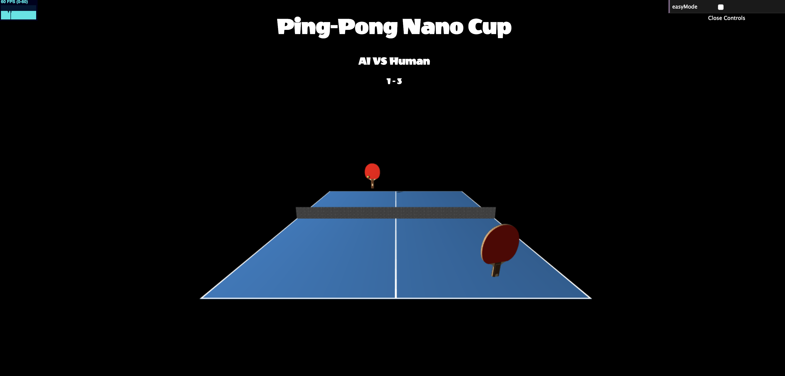

# Ping-Pong Nano Cup with Kinect (ongoing)

## Overview
 - Extended from my ping pong game version 1, user uses Kinect to control the ping-pong paddle movement.

### Features
 - Use Kinect camera instead of Leap Motion to track player's hand movements and link the data to paddle movements.

### Libraries used
- Three.js
- Kinect

### To do:
- trim data to make movement smoother
- finish game states
- finish one round

## Limitation so far
- Kinect camera can't track hand's rotation, therefore can't rotate the paddle via hand rotation.
